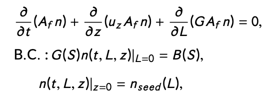
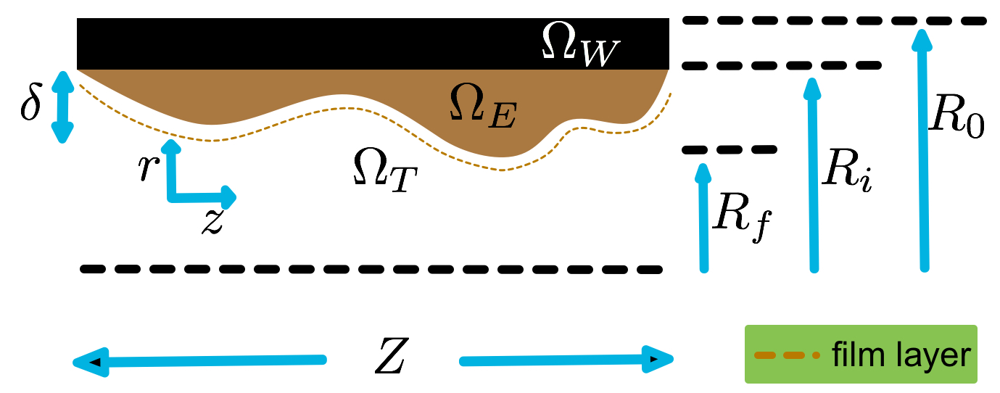
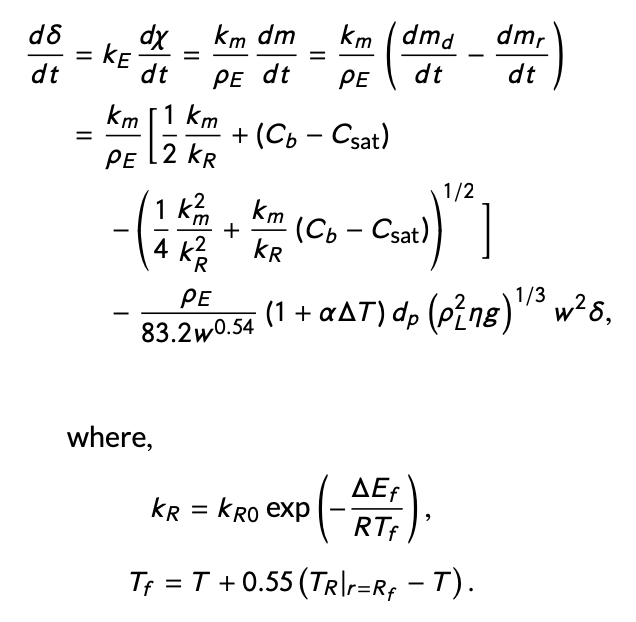
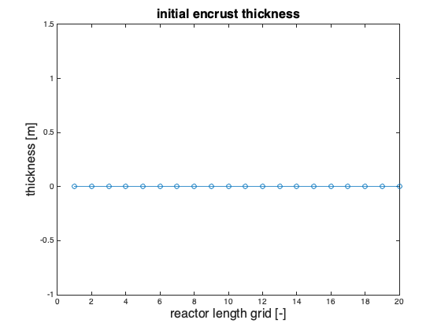
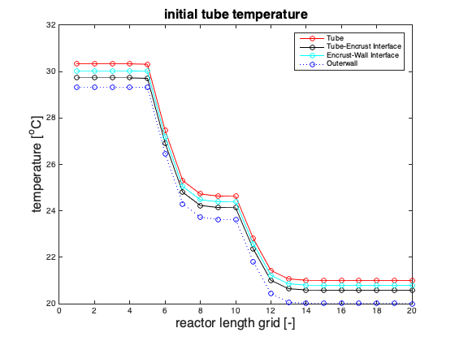
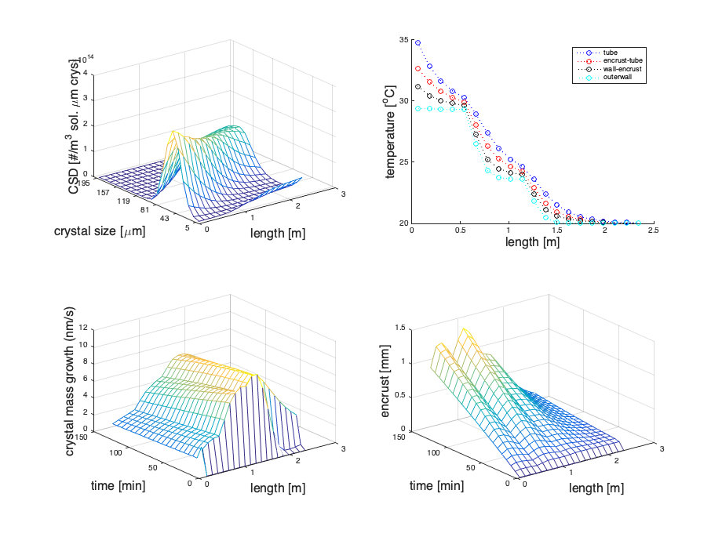
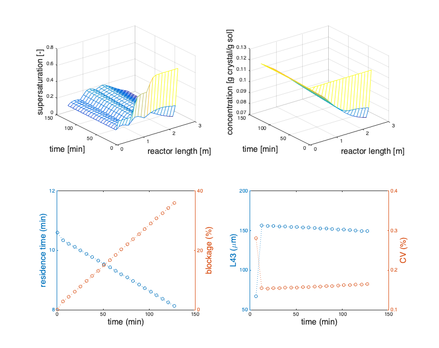

# CrystalAFC

## Table of Contents

- [Overview](#Overview)
- [Dependencies](#Dependencies)
- [Main File](#Main-File)
- [Output](#Output)

## Overview
MATLAB scripts to simulate anti-fouling control of plug-flow crystallization via heating and cooling cycle as described in https://doi.org/10.1016/j.ifacol.2015.08.180 and https://doi.org/10.1109/LLS.2017.2661981. The scripts solve a set of partial differential equations (PDE) that describe a crystallization and encrustation process in a plug flow:



Here, *n* is the crystal size distribution (CSD), *u* z is the slurry flow velocity, *G* is the crystal growth rate, *B* is the nucleation rate, *n_{seed}* is the seed CSD, *z* is the reactor axis, *L* is the crystal size axis, and *t* is the time axis. *A_{f}(t, z)* = *πR_{f}^{2}(t, z)* is the flow area within the tube which changes with time and along the reactor length due to encrustation. A model for encrustation in a PFC inspired from fouling kinetics commonly found in heat exchangers is shown in the figure below.



The domains of the crystallization and encrustation are divided into three regions, namely the reactor wall *(Ω_{W} : r ∈ [R_{f}, R_{0}])*, the encrust *(Ω_{E} : r ∈ [R_{i} , R_{f} ])* and the convection within the tube *(Ω_{T} : r ∈ [0, R_{i} ])*. Additionally, the encrustation dynamics can be summarized as follows:



Where *m_{d}* and *m_{r}* are the mass deposited and removed, respectively, *δ* is the encrust thickness, *k_{E}* is the thermal conductivity, *χ* is the thermal resistance, *ρ_{E}* is the encrust density, *m* is the encrust mass, *k_{m}* is the mass transfer coefficient of solute from the bulk solution to the encrust film, *k_{R}* is the adsorption rate of solute to encrust, *C_{b}* is the bulk solute concentration, *C_{sat}* is the saturation concentration within the boundary or film layer, *w* is the bulk fluid velocity. *α* is the linear expansion coefficient, *∆T* is the temperature difference between the reactor wall and the encrust surface, *d_{p}* is the encrust particle diameter, *η* is the film viscosity, and *g* is the gravitational acceleration. The adsorption rate is modeled as an Arrhenius-type expression where *k_{R0}* is the adsorption rate constant, *∆E_{f}* is the activation energy, *R* is the ideal gas constant, and *T_{f}* is the film temperature.

Please look into the articles for more details, including the mass and energy balances. 

## Dependencies

```ruby
MATLAB R2015a
```

## Main File

The PFC_main.m is the main file which solves the above set of equations. It is is divided into three sections; The first is the initialization of control parameters, including reactor dimensions and jacket temperatures. 

```matlab
%% Initialize parameters
flow=40; % [ml/min], volumetric flow
Tfeed=38; % feed temperature

% Control temperatures   
Tseg=[Tfeed,29.3119,23.6231,20.0005,20.0000]; % e.g. from GA optimization
    % (case study 1, maximizing growth)

resol=5;
noseg=size(Tseg,2)-1;
T=stepT(Tseg,noseg+1,resol);
T(1:3)=T(4);
SizSeg=0.6; % -----------------4

...

save('control_params.mat', 'flow', 'Tfeed', 'Tseg', 'resol', 'noseg', ...
    'SizSeg', 'xmin', 'xmax', 'Nx', 'Tc', 'Tmax', 'ti', 'tf', 'Nt', ...
    'savefilename')
```
The initial conditions (ICs) are then calculated for input into the PDEs:

```matlab
%% calculating initial conditions
NL=20;
Lmax=200e-6; % [m], maximum size of the crystals considered
Lmin=0; % minimum size 
delL = (Lmax-Lmin)/NL; % [m], grid size
L=(delL/2:delL:Lmax-delL/2); % [m], grid range
    % (set for numerical purpose)

...

save('initial_conditions.mat', 'Tw0', 'Te0', 'T0', 'C0', 'delta0',... 
    'f0', 'fin')
```
The PDEs are defined as a separate function named encrustpfcV6 defined in a separate .m file, where the high-resolution finite volume method is implemented. It is also where the crystallization system parameters are set. To run the simulation, the encrustpfcV6 function is called with control parameters and ICs as inputs

```matlab
[fn,Tw,Te,T,f,delta,Rf,C,Sigma,rest,L43,blockage,t,x,r,L] = ...
encrustpfcV6(Nx,flow,xmax,ti,tf,Nt,Tc,Tw0,Te0,T0,Tfeed,C0,delta0,f0);

save(savefilename,'fn','Tw','Te','T','f','delta','Rf','C',...
        'Sigma','rest','t','x','r','L','L43','blockage');
```

## Output 
The whole script may be run simply by typing *PFC_main* onto the terminal. Initial conditions will then be plotted for the user to check prior to continuing with the simulation.  

```matlab
>> PFC_main
Check initial conditions. Press any key to continue
```
Example plots of initial conditions:

|---------|--------|
||

When the user press any key to continue, the computation continues and numerical output from the ode is printed until it is solved. 

```matlab
t =

     0
...

t =

   7.6341e+03
   
y =

   1.0e+10 *

    0.0000
    0.0000
    0.0000
    0.0000
    ...
    0.0213
    0.0598
    0.2209
    0.7063
    1.6612
    2.9930
    3.2032
    2.7485
    ...
>>    
```
One can then plot the results:
```matlab
>> PFC_plot
avg_L43: 148.7959
avg_CV: 0.16477
crustmass: 0.15972
>> 
```
|output variables across tube length and time|
|-----------------------------------------------|
||
||
